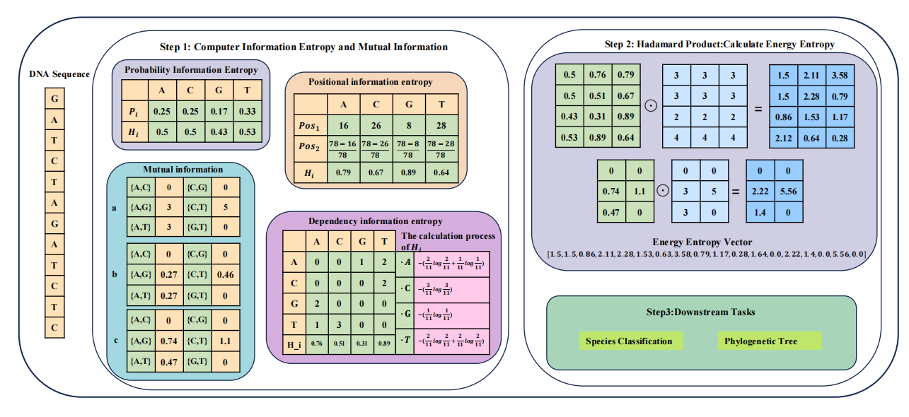

 
# EEV

## Architecture Diagram

Below is the architecture diagram of the project:




This project is the core code for EEV (Energy Entropy Vector). Currently, the core algorithm part has been uploaded. After the paper is accepted, we will further update the data preprocessing section and the algorithm-related content.

## Usage

1. **Install dependencies**: Please ensure that you have installed the required Python libraries.

2. **Example Code**:

```python
# usage.py

from eev.eev import EnergyEntropy

# DNA
dna_seq = 'AGCTGAGTAAGATCA'
energy_values = 2
eev = EnergyEntropy(data_type='dna', energy_values=energy_values)
vector = eev.seq2vector(dna_seq)
print("DNA Sequence Vector:")
print(vector)

# Protein
protein_seq = 'PGGSLTLSCAASEPVFEANTMGWYRQAPGKQRELVASIRNVGGTNYADSVKGRF'
eev = EnergyEntropy(data_type='protein', energy_values=energy_values)
vector = eev.seq2vector(protein_seq)
print("\nProtein Sequence Vector:")
print(vector)

# RNA
rna_seq = 'ACGUAAAUCG'
eev = EnergyEntropy(data_type='rna', energy_values=energy_values)
vector = eev.seq2vector(rna_seq)
print("\nRNA Sequence Vector:")
print(vector)
```

3. **Run the code**:

Save the above code in the `usage.py` file and run the following command:

```bash
python usage.py
```

### Explanation:

- **DNA Sequence**: The DNA sequence is passed into the `EnergyEntropy` class, and it is converted into a vector using the `seq2vector` method and printed out.
- **Protein Sequence**: The protein sequence is passed into the `EnergyEntropy` class, and it is also converted into a vector using the `seq2vector` method and printed out.
- **RNA Sequence**: The RNA sequence is passed into the `EnergyEntropy` class, which converts it into a vector and prints it out.

By following these steps, you can run the core algorithms of the `EEV` project and view the vectorization results for DNA, protein, and RNA sequences.


## Citation
```
@article{wang2025energy,
  title={Energy entropy vector: a novel approach for efficient microbial genomic sequence analysis and classification},
  author={Wang, Hao and Hu, Guoqing and Yau, Stephen ST},
  journal={Briefings in Bioinformatics},
  volume={26},
  number={5},
  pages={bbaf459},
  year={2025},
  publisher={Oxford University Press}
}

```
